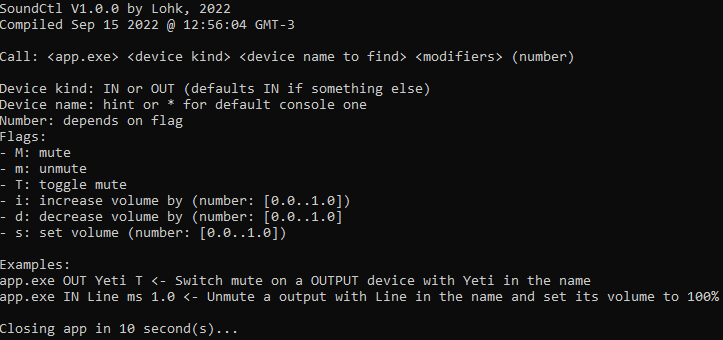

# Sound Control (SoundCtl)

This project was developed to allow anyone to control any device volume by just calling this app with the device name and the desired commands.

This way, from any software that allows binding keys to commands, you can control your system volume, or your microphone, or any other device, with one single call!

Example of help command:

